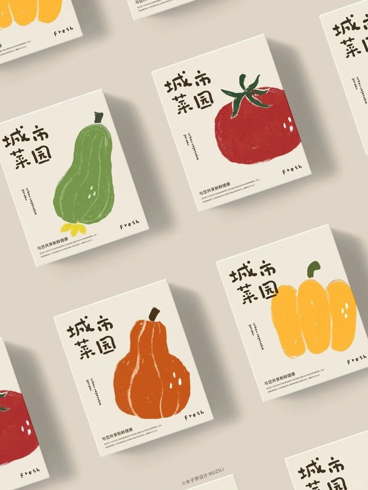
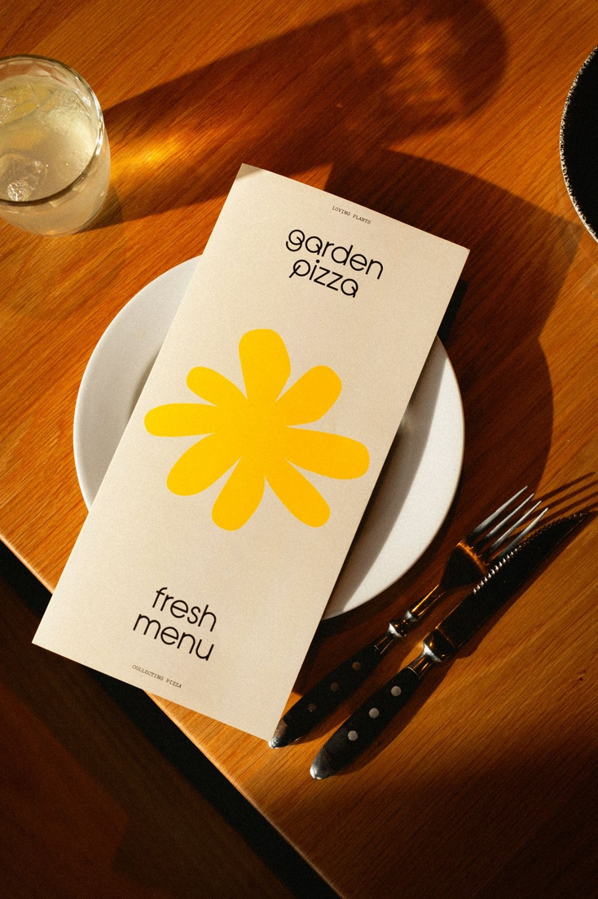
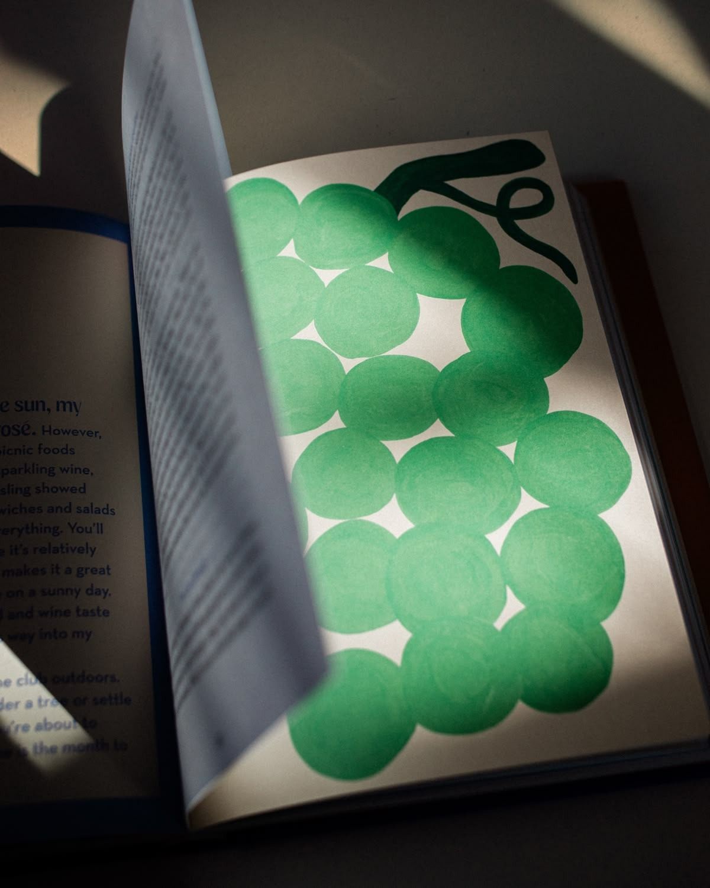
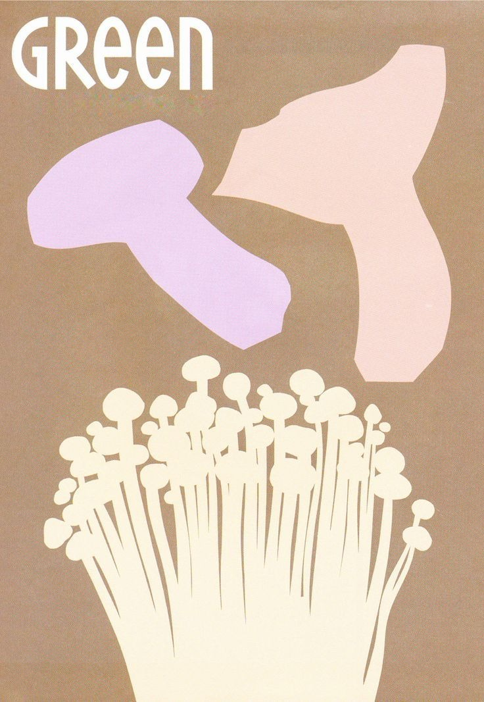
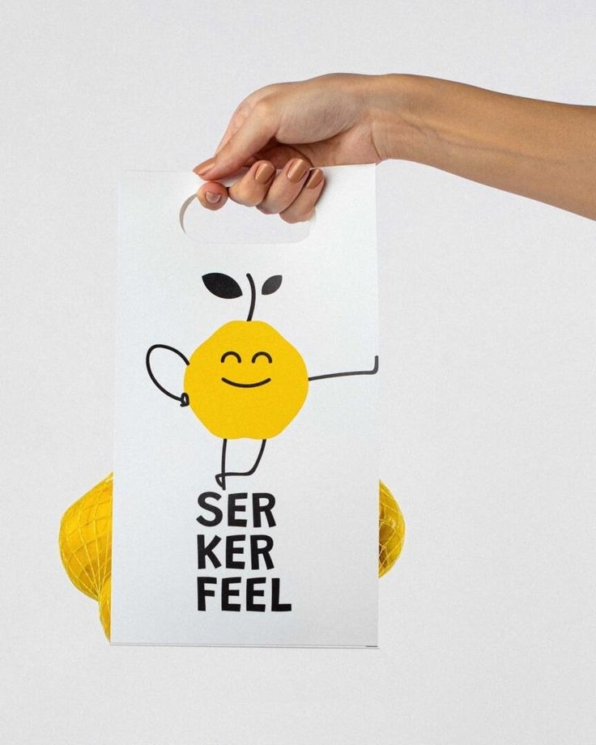
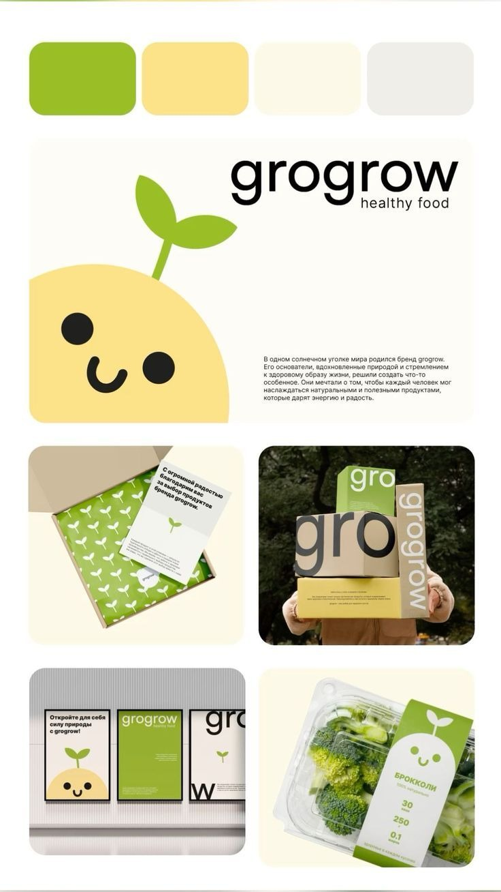
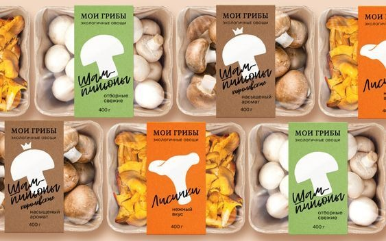
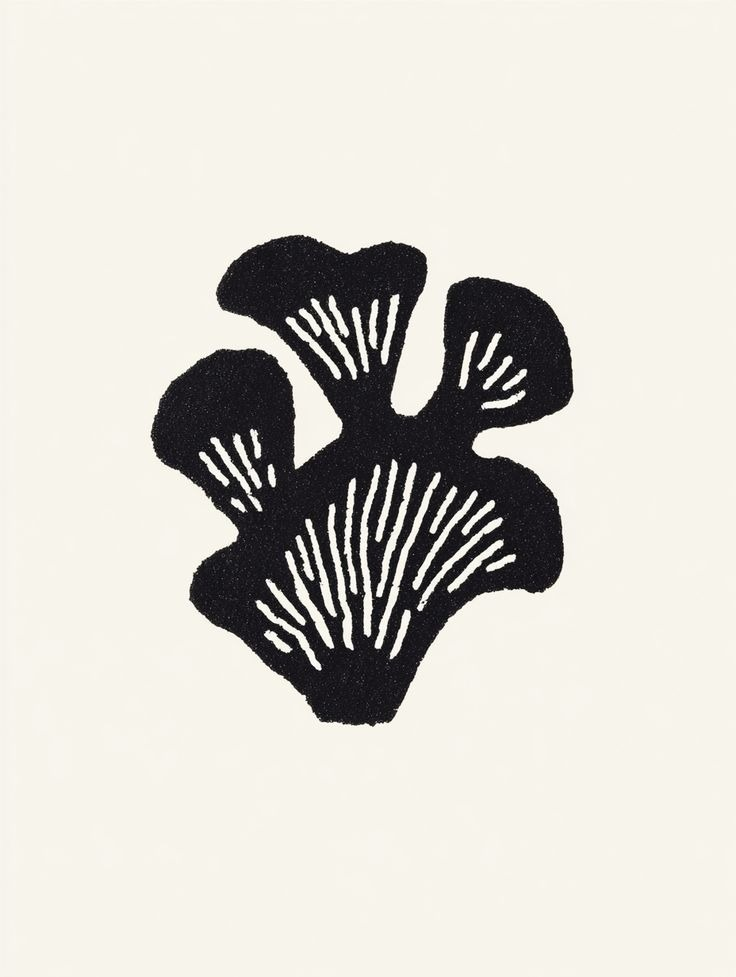
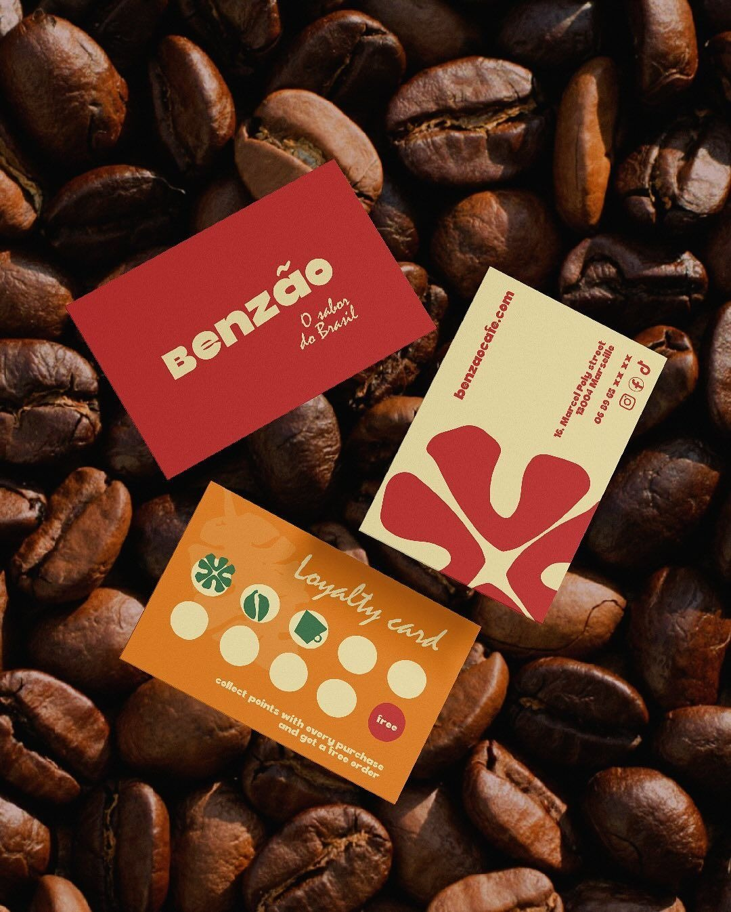

# BRANDING-PROMPT: Stone Fungus — 4 Enfoques de Identidad Visual

> Este documento es una instrucción completa para generar assets de branding como archivos PNG y HTML.
> Debe ser leído como contexto por un agente de IA para producir todos los archivos.

---

## PARTE 1: CONTEXTO DE LA MARCA

### ¿Qué es Stone Fungus?
Stone Fungus es una pizzería gourmet ubicada en **Temuco, Chile**, especializada en **pizzas artesanales con hongos exóticos y de autor**. La marca fusiona la tradición italiana del horno de piedra con ingredientes del bosque nativo del sur de Chile (hongos silvestres, comestibles gourmet).

### Menú actual (6 pizzas)
| Pizza | Precio CLP | Característica |
|-------|-----------|----------------|
| La Enoki | $14.990 | Hongos enoki, queso de cabra, miel de ulmo — **Seasonal** |
| La Leonera | $16.990 | Mix de hongos silvestres, trufa negra, parmesano — **Seasonal** |
| La Porcina | $13.990 | Porcini deshidratado, mozzarella ahumada, romero |
| La Carnita | $15.990 | Pulled pork, hongos ostra, BBQ de merkén |
| La Veggie | $12.990 | Champiñón, espinaca, tomate seco, albahaca |
| La Napolitana | $11.990 | Tomate San Marzano, mozzarella fresca, albahaca |

### Concepto central
"La pizza es un lienzo. La masa madre es la base, la piedra le da carácter, y los hongos son la firma del autor."

### Taglines usados
- "Masa madre, piedra & hongos de autor"

### Logo actual
Sello/badge circular monocromático (blanco y negro) con:
- Personaje antropomórfico: cabeza de hongo, cuerpo de piedra, textura stipple/puntillismo
- Expresión amigable, ligeramente mística, rayos radiantes detrás
- "STONE" curvado arriba, "FUNGUS" curvado abajo (serif clásica)
- Dos hongos pequeños flanqueando al personaje
- Estética de cervecería craft / grabado antiguo

### Problema con el logo actual
- Demasiado detalle para escalar a tamaños pequeños
- Formato circular difícil de adaptar a cajas horizontales
- Estética más de cervecería que de pizzería
- Se necesita mayor versatilidad para imprenta y embalaje

### Objetivos del rediseño
1. Simplificar para versatilidad (imprenta, cajas, web, favicon, stickers)
2. Mantener la esencia (hongo + gourmet)
3. Crear un sistema visual completo (no solo un logo)
4. Posicionar como marca premium pero accesible
5. Los colores actuales pueden mantenerse o cambiarse si está justificado
6. El estilo visual que se busca es "pictóric pop art" ya que está muy bien recibido en otras marcas de europa y asia.

---

## PARTE 2: ANÁLISIS DE REFERENCIAS — Estilo "Pictóric Pop Art" (9 referencias)

Se analizaron 9 referencias de branding e ilustración en estilo **pictóric pop art** — formas orgánicas simplificadas, colores planos, trazo expresivo, estética entre lo artístico y lo comercial. Las imágenes están en `branding/_references/`:

### Referencia 1 — Silueta orgánica de hongos (linocut)

- **Estilo:** Linocut / block print monocromático. Negro sobre crema. Formas orgánicas de hongos (chanterelle/ostra) con líneas blancas internas que sugieren laminillas/gill
- **Paleta:** Negro `#1A1A1A` + crema `#F5F0E8` (2 colores)
- **Key insight:** La forma orgánica ES el ícono — sin texto, sin contenedor, sin adornos. La textura granulada del trazo da calidez artesanal. Las líneas negativas (blancas) dentro de la silueta crean profundidad con mínimos recursos. **Directamente aplicable a Stone Fungus: un hongo como forma pura, reconocible como ícono autónomo**

### Referencia 2 — Benzão Café (branding brasileño)

- **Estilo:** Pictóric pop art aplicado a branding gastronómico. Café brasileño en Marsella. Tres piezas (tarjetas) sobre granos de café
- **Paleta:** Rojo cálido `#C0392B` + crema `#F5E6C8` + naranja `#E8973B` + verde oscuro `#2D5A3D`
- **Elementos clave:** Tipografía custom redondeada ("benzão" en lowercase bold). Forma orgánica abstracta en rojo sobre crema (reverso) — estilo Matisse recortado. Loyalty card con íconos pictóricos (trébol, taza, grano). Los íconos son formas planas, sin outline
- **Key insight:** La forma orgánica abstracta funciona como identidad visual sin ser literal. El sistema de color cálido (rojo + crema + naranja) transmite calidez latina. **Demuestra que una forma orgánica abstracta (como un hongo estilizado) puede ser el corazón visual de una marca gastronómica**

### Referencia 3 — 城市菜园 Urban Garden (packaging chino, MUZILI Design)

- **Estilo:** Pictóric pop art editorial. Packaging de verduras con ilustraciones hand-painted sobredimensionadas. Cada caja = un vegetal gigante (tomate, calabaza, zapallo, pimiento)
- **Paleta:** Fondo crema/blanco + colores naturales saturados (rojo tomate, verde calabaza, naranja calabaza, amarillo pimiento)
- **Elementos clave:** Ilustración loose/suelta que ocupa 70% de la caja. Trazo visible del pincel (no vector limpio). Tipografía bold en caracteres chinos + "Fresh" en inglés. Composición asimétrica, el vegetal se sale del marco
- **Key insight:** El ingrediente protagonista pintado a gran escala = identidad inmediata. La imperfección del trazo pictórico da autenticidad artesanal. **Para Stone Fungus: cada pizza podría tener su hongo pintado en estilo pictóric como protagonista del packaging — sistema de variaciones donde el hongo cambia pero el estilo unifica**

### Referencia 4 — Garden Pizza (menú pictóric)

- **Estilo:** Pictóric minimal floral. Menú de pizzería sobre papel crema con forma botánica (margarita/daisy) amarilla grande y centrada
- **Paleta:** Crema `#F5F0E8` + amarillo `#FFD43B` + negro `#111111` (3 colores)
- **Elementos clave:** Tipografía lowercase moderna sans-serif ("garden pizza", "fresh menu"). Mucho espacio blanco. La forma floral es plana, sin degradados, sin outline — un blob orgánico de color. Textos auxiliares mínimos ("loving plants", "collectivo pizza")
- **Key insight:** Demuestra que el estilo pictóric pop art funciona perfectamente para pizzerías. La restricción a 3 colores + 1 forma orgánica grande = elegancia silenciosa. **El enfoque "menos es más" donde una sola forma de color plano sobre fondo neutro crea impacto premium. Aplicable directamente: un hongo amarillo/dorado como forma central**

### Referencia 5 — Uvas pictóricas (ilustración editorial)

- **Estilo:** Ilustración editorial pictóric. Racimo de uvas verdes construido con círculos superpuestos de un solo color + tallo/hoja en verde oscuro. Página de libro/revista
- **Paleta:** Verde medio `#5DB075` + verde oscuro `#1A3D2B` + crema fondo
- **Elementos clave:** Cada uva es un círculo imperfecto (no geométrico perfecto). La superposición con transparencia/opacidad variable da sensación de volumen. El tallo es un trazo caligráfico suelto. Textura visible de tinta/impresión
- **Key insight:** Formas geométricas simples (círculos) + imperfección manual = orgánico y sofisticado. **Para Stone Fungus: un hongo puede construirse con semicírculo (cap) + rectángulo (tallo) en esta misma lógica de formas básicas con textura pictórica**

### Referencia 6 — Póster "GREEN" de hongos (ilustración japonesa)

- **Estilo:** Pictóric pop art japonés con temática directa de hongos. Siluetas planas de hongos (shiitake/king oyster en lavanda y rosa) + racimo de enoki (crema/blanco) sobre fondo beige cálido
- **Paleta:** Beige cálido `#B8A48A` + lavanda `#C8A5D0` + rosa pálido `#F0C8C8` + crema `#F5F0E0`
- **Elementos clave:** Tipografía bold sans-serif "GREEN" en blanco. Los hongos son siluetas planas sin detail interno (no hay laminillas, no hay textura). Las formas son orgánicas, asimétricas, como recortadas a mano. El enoki se resuelve con tallos finos verticales que terminan en círculos pequeños
- **Key insight:** **REFERENCIA MÁS DIRECTA para Stone Fungus.** Demuestra que los hongos en estilo pictóric pop art son visualmente poderosos. La paleta suave/warm no compite con las formas. Cada variedad de hongo tiene una silueta reconocible diferente. **El sistema de siluetas de hongos por variedad (enoki, shiitake, ostra, porcini) puede ser el core visual de Stone Fungus — cada pizza con su hongo en su color**

### Referencia 7 — Serkerfeel (packaging con mascota)

- **Estilo:** Pictóric pop art con mascota minimalista. Bolsa de papel blanca para marca de limones/cítricos. Personaje: limón amarillo con cara kawaii (ojos cerrados sonrientes) + brazos/piernas en trazo negro fino + hoja negra
- **Paleta:** Blanco `#FFFFFF` + amarillo `#FFD43B` + negro `#111111` (3 colores)
- **Elementos clave:** La mascota es una forma geométrica simple (círculo amarillo) + elementos de línea negra (extremidades, cara). La tipografía "SER KER FEEL" está apilada en 3 líneas, bold sans-serif, negra. Máxima simplicidad: 3 colores, 1 personaje, 1 tipografía
- **Key insight:** Un ingrediente convertido en personaje con mínimos recursos (forma de color + cara + palitos). La expresión kawaii da personalidad sin complejidad. **Para Stone Fungus: el hongo como personaje puede lograrse con una forma orgánica de color + 2 puntos (ojos) + líneas simples para extremidades — pictóric + adorable**

### Referencia 8 — Grogrow Healthy Food (sistema de marca completo)

- **Estilo:** Pictóric pop art como sistema de identidad completo. Marca de comida saludable (rusa). Mascota: forma redondeada amarilla/verde con cara kawaii + brote/sprout en la cabeza
- **Paleta:** Verde lima `#8BC34A` + amarillo suave `#F5E6A0` + crema `#F5F0E0` + gris claro `#E0E0E0`
- **Elementos clave:** Logotipo "grogrow" en lowercase sans-serif moderna. La mascota aparece en múltiples escalas: gigante en pósters, pequeña como ícono en etiquetas. Packaging con patrón de brotes/sprouts repetidos. Sistema cromático verde-amarillo-crema consistente en cajas, tarjetas, etiquetas de producto (brócoli)
- **Key insight:** **Demuestra el sistema completo** — cómo una mascota pictóric escala a todas las aplicaciones: logo, packaging, tarjetas, etiquetas, patrón. La consistencia cromática es clave: todo vive en el mismo rango tonal verde-amarillo-crema. **Para Stone Fungus: la mascota-hongo debe funcionar igual — gigante en cajas, pequeña como favicon, como patrón repetido, como sticker**

### Referencia 9 — Мои Грибы / My Mushrooms (packaging de hongos)

- **Estilo:** Branding comercial de hongos frescos (marca rusa). Packaging para bandejas de champiñones, chanterelles y otras variedades. Silueta de hongo blanca como ícono central + etiquetas de color por variedad
- **Paleta:** Blanco `#FFFFFF` + naranja `#E8973B` + verde `#6B9B4F` + kraft `#C4A77D` + beige `#F5E6D0`
- **Elementos clave:** Ícono de hongo como silueta simple y limpia (blanca sobre color). Tipografía rusa bold con sizing expresivo (la palabra "Шампиньоны" / champiñones ocupa toda la etiqueta). Cada variedad tiene su color: beige = champiñón blanco, naranja = chanterelle, verde = champiñón premium. Kraft como material base
- **Key insight:** **Referencia directa de producto mushroom.** El sistema color = variedad es potente y escalable. La silueta de hongo funciona como ícono universal de la marca. **Para Stone Fungus: confirma que el sistema silueta-de-hongo + color-por-variedad es viable comercialmente y reconocible al instante — adaptarlo al estilo pictóric (más suelto, más artístico) lo elevaría**

### Patrones clave identificados (Pictóric Pop Art)
1. **Forma orgánica como protagonista** (Ref 1, 4, 5, 6): Una silueta grande de color plano ES la identidad. Sin outline, sin degradados
2. **Paleta limitada y cálida** (Ref 1, 2, 4, 7): Máximo 3-4 colores. Fondos crema/neutros. Los colores son cálidos y naturales, no neón
3. **Imperfección intencional** (Ref 1, 3, 5): Bordes irregulares, textura de trazo visible, sensación hand-made. La imperfección = autenticidad
4. **Ingrediente = ícono a gran escala** (Ref 3, 5, 6, 9): El ingrediente principal pintado/recortado como forma gigante que domina la composición
5. **Mascota como forma simple + cara** (Ref 7, 8): Un blob de color + ojos + extremidades de línea = personaje con personalidad
6. **Sistema por variedad** (Ref 3, 6, 9): Cada variante del producto tiene su forma/color propio pero el lenguaje visual las unifica
7. **Tipografía lowercase moderna** (Ref 4, 7, 8): Sans-serif humanista, peso medium, lowercase — anti-grito, susurrada, premium-accesible
8. **Mucho espacio vacío** (Ref 1, 4, 5): La forma respira. El fondo neutro amplifica el impacto de la forma de color
9. **Escalabilidad del sistema** (Ref 8): La misma forma funciona como logo gigante, favicon, patrón, sticker — versatilidad total

### Síntesis: Dirección visual para Stone Fungus
Las 9 referencias convergen en un estilo claro: **siluetas orgánicas de hongos en colores planos sobre fondos neutros cálidos, con tipografía moderna lowercase y máxima simplicidad**. Esto se traduce en:
- **Ícono central:** Silueta de hongo (como Ref 1 y 6) — orgánica, imperfecta, reconocible
- **Sistema de variaciones:** Cada pizza tiene su hongo en su color (como Ref 3, 6, 9)
- **Mascota opcional:** El hongo con cara kawaii (como Ref 7, 8) para packaging y redes
- **Tipografía:** Lowercase, sans-serif moderna, que no compita con la forma pictórica
- **Paleta:** Colores naturales cálidos del bosque/hongo — beige, dorado, verde musgo, crema, con acentos de color por variedad

---

## PARTE 3: LOS 4 ENFOQUES SELECCIONADOS

> **Nota:** Se mantienen los 4 enfoques seleccionados en la curación anterior (Monolito Bold, Piedra & Tinta, Fungi Minimal, Alquimia). Las 9 referencias pictóric pop art analizadas en la PARTE 2 deben usarse como dirección visual para la generación de todos los assets — cada enfoque debe incorporar el lenguaje visual pictóric (formas orgánicas, colores planos, trazo expresivo, fondos neutros cálidos).

Cada enfoque define 4 elementos a generar:
- **Logo** (isotipo + logotipo)
- **Tipografía** (el texto "Stone Fungus" estilizado)
- **Mascota** (personaje hongo)  
- **Caja de pizza** (vista cenital/top-down de la tapa)

---

### ENFOQUE 1: "Monolito Bold"
**Filosofía:** La palabra como ícono. Tipografía masiva ES el logo.

**Paleta:**
- Negro: `#0A0A0A`
- Blanco: `#FAFAFA`
- Dorado acento: `#C9A96E`

**Logo:**
- Logotipo puro, sin isotipo separado
- "STONE" apilado sobre "FUNGUS" en sans-serif ultra bold condensada
- La "O" de STONE tiene una silueta de hongo calada/negativa en su interior
- Sin bordes, sin círculos, sin contenedores
- Monocromático: negro sobre blanco

**Tipografía:**
- Sans-serif ultra bold condensada (estilo Druk Wide Bold / Impact)
- ALL-CAPS, tracking apretado, letras casi se tocan
- Versión stacked (2 líneas) que llena todo el ancho
- El peso visual es máximo

**Mascota:**
- Hongo minimalista con cuerpo de piedra angular/geométrica
- Estilo fat-line con trazo grueso uniforme
- Ojos grandes redondos, sonrisa sutil, actitud "cool sin esforzarse"
- Brazos y piernas tipo stickman, sostiene un slice de pizza
- Solo 2 colores: negro + blanco

**Caja de pizza (vista cenital):**
- Todo negro mate (#0A0A0A)
- "STONE FUNGUS" en blanco gigante que ocupa toda la tapa (bleed total)
- Lateral representado con "SF SF SF SF" repetido
- Interior: mascota con quote "La pizza es un hongo que crece en piedra"

---

### ENFOQUE 2: "Piedra & Tinta"
**Filosofía:** Evolución del logo actual. Honrar el ADN existente, modernizar.

**Paleta:**
- Negro: `#111111`
- Kraft natural: `#C4A77D`
- Blanco: `#F8F5F0`
- Gris textura: `#666666`

**Logo:**
- Se mantiene el personaje hongo-piedra pero re-dibujado más simple
- Sin formato circular — el personaje se libera del badge
- Puntos de stipple más gruesos y regulares
- "STONE FUNGUS" al lado o debajo, lockup flexible

**Tipografía:**
- Sans-serif extendida (estilo Monument Extended / PP Neue Machina)
- ALL-CAPS con tracking amplio (L E T T E R S P A C E D)
- Sensación de grabado en piedra
- Subtítulo "Pizza de Hongos" en serif fina

**Mascota:**
- Evolución del personaje actual: misma pose frontal, expresión amigable
- Simplificado a 3 niveles de tono: negro, gris medio (#666), blanco
- Textura de stipple como medio tono regular y escalable
- Versión ultra-simple para favicon: solo cabeza-hongo

**Caja de pizza (vista cenital):**
- Kraft natural sin pintar (#C4A77D)
- Impresión en tinta negra solamente (1 color)
- Personaje como sello/stamp grande en la tapa
- Bordes: "STONE FUNGUS — PIZZA DE HONGOS DE AUTOR — TEMUCO"

---

### ENFOQUE 3: "Fungi Minimal"
**Filosofía:** Reducción extrema. 1 color + 1 símbolo. Inspirado en Pizzeta.

**Paleta:**
- Mostaza hongo: `#D4A843`
- Blanco: `#FFFFFF`
- Variantes: verde `#4A7C59`, negro `#1A1A1A`

**Logo:**
- Silueta de hongo en su forma más esencial: semicírculo + línea vertical (cap + tallo)
- 4 trazos máximo. Funciona como favicon de 16×16px
- "stone fungus" en lowercase sans-serif al lado, peso light

**Tipografía:**
- Sans-serif humanista, limpia, cálida (estilo Roobert / Cerebri Sans)
- Lowercase, peso regular a medium
- Anti-grito, susurrado, elegancia silenciosa
- El espacio negativo hace el trabajo

**Mascota:**
- No mascota tradicional: sistema de siluetas de hongos diferentes (enoki, portobello, shiitake, ostra)
- Cada pizza tiene su ícono de hongo específico
- Para personificación: basta con 2 puntos (ojos) en cualquier silueta

**Caja de pizza (vista cenital):**
- Color mostaza (#D4A843) completo
- Tipografía en blanco puro
- "stone fungus" pequeño arriba-izquierda
- Silueta del hongo de esa pizza (grande, centrada)
- Variaciones de color por línea: dorado, verde, negro

---

### ENFOQUE 4: "Alquimia"
**Filosofía:** El hongo como elemento mágico/alquímico. Boticario + ciencia.

**Paleta:**
- Negro: `#0D0D0D`
- Dorado/Cobre: `#B8860B`
- Verde profundo: `#0A2E1C`
- Crema pergamino: `#F2E8D5`

**Logo:**
- Hongo en estilo botánico/científico (línea fina, preciso) dentro de marco hexagonal
- "STONE FUNGUS" debajo en versalitas serif con tracking amplio
- "Est. MMXXVI" y coordenadas de Temuco como datos del espécimen
- Se lee como etiqueta de frasco de boticario

**Tipografía:**
- Serif clásica elegante (estilo Cormorant / EB Garamond)
- Versalitas (small-caps) como formato principal
- Tracking generoso, peso regular — preciso, no pesado
- Números old-style con ascendentes y descendentes

**Mascota:**
- No cartoon: "hongo ilustrado" recurrente, estilo láminas botánicas de Ernst Haeckel
- Cada variedad de hongo tiene su ilustración propia con nombre científico
- Si se personifica: hongo con monóculo, estilo sabio
- Líneas finas cruzadas para sombras (estilo grabado en cobre)

**Caja de pizza (vista cenital):**
- Negro profundo (#0D0D0D) o verde botella (#0A2E1C)
- Tipografía en dorado (#B8860B)
- Ilustración botánica del hongo principal con nombre científico
- Interior: "Composición" en vez de "ingredientes"
- Sello hexagonal como cierre

---

## PARTE 4: INSTRUCCIONES TÉCNICAS DE GENERACIÓN

### Estructura de archivos a crear

```
branding/
  README.md
  _references/
    1.jpeg ... 9.jpeg
  _shared/
    preview.html
    styles.css
  approach-01-monolito-bold/
    logo.png
    typography.png
    mascot.png
    pizza-box.png
    preview.html
  approach-02-piedra-tinta/
    logo.png
    typography.png
    mascot.png
    pizza-box.png
    preview.html
  approach-03-fungi-minimal/
    logo.png
    typography.png
    mascot.png
    pizza-box.png
    preview.html
  approach-04-alquimia/
    logo.png
    typography.png
    mascot.png
    pizza-box.png
    preview.html
```

### Reglas para los PNG

1. **Tamaño:** Cada PNG debe ser de **1024×1024px** (cuadrado) excepto pizza-box que usa **1200×1200px**
2. **Colores:** Usar EXACTAMENTE los hex definidos en cada enfoque
3. **Tipografía:** Usar las fuentes sugeridas en la tabla de Google Fonts. Renderizar el texto como parte de la imagen
4. **Fondos:** Incluir fondo sólido con el color apropiado (no transparente, salvo que se indique)
5. **Complejidad de mascota:** Estilo pictóric pop art — formas orgánicas simplificadas, colores planos, trazo expresivo. NO fotorrealista
6. **Logo:** Debe funcionar a 64×64px (verificar legibilidad al reducir)
7. **Pizza-box:** Vista cenital (top-down) de la tapa cerrada, mostrando layout del diseño
8. **Calidad:** PNG-24 con buena compresión. Sin artefactos visibles
9. **Estilo consistente:** Todas las imágenes de un mismo enfoque deben compartir el mismo lenguaje visual
10. **Formato:** Cada archivo debe ser un PNG válido, visualizable en cualquier browser

### Reglas para preview.html (por enfoque)

Cada `approach-XX/preview.html` debe:
- Mostrar los 4 PNGs en una grilla de 2×2
- Título con el nombre y número del enfoque
- Fondo oscuro (#111) o claro (#f5f5f5) según la paleta del enfoque
- Etiquetas debajo de cada PNG: "Logo", "Tipografía", "Mascota", "Caja de Pizza"
- Ser un HTML autocontenido con estilos inline o `<style>` interno
- Los PNGs se incrustan via `` (rutas relativas)

### Reglas para el preview.html general (_shared/preview.html)

- Galería que carga los 4 enfoques
- Navegación con tabs o scroll vertical
- Para cada enfoque: título + descripción de 1 línea + los 4 thumbnails
- Links a cada `approach-XX/preview.html` individual
- Responsive: funciona en desktop y móvil
- Incluir la paleta de colores como swatches visuales por enfoque

### Reglas para README.md

- Índice con links a cada enfoque
- Tabla resumen con: número, nombre, tono, paleta (hex), target
- Instrucciones para ver los previews (abrir preview.html en browser)

### Fuentes Google Fonts sugeridas

| Enfoque | Fuente principal sugerida | Fallback |
|---------|--------------------------|----------|
| 1 - Monolito Bold | `Bebas Neue` o `Oswald` weight 700 | Impact, sans-serif |
| 2 - Piedra & Tinta | `Space Grotesk` weight 500 | Helvetica, sans-serif |
| 3 - Fungi Minimal | `DM Sans` weight 400 | Helvetica, sans-serif |
| 4 - Alquimia | `Cormorant Garamond` weight 400 | Times New Roman, serif |

### Orden de implementación sugerido

Generar enfoque por enfoque, en orden del 1 al 4. Para cada enfoque:
1. Crear la carpeta `approach-XX-nombre/`
2. Generar `logo.png`
3. Generar `typography.png`
4. Generar `mascot.png`
5. Generar `pizza-box.png`
6. Generar `preview.html`
7. Verificar que los 4 PNGs se visualicen correctamente

Al terminar los 4:
8. Crear `_shared/preview.html`
9. Crear `_shared/styles.css`
10. Crear `README.md`

---

## PARTE 5: RESUMEN COMPARATIVO

| # | Enfoque | Tono | Target |
|---|---------|------|--------|
| 1 | Monolito Bold | Premium-minimal | Millennials urbanos |
| 2 | Piedra & Tinta | Artesanal-evolucionado | Clientes actuales |
| 3 | Fungi Minimal | Ultra-limpio | Diseño-conscientes |
| 4 | Alquimia | Sofisticado-místico | Premium, coleccionistas |
